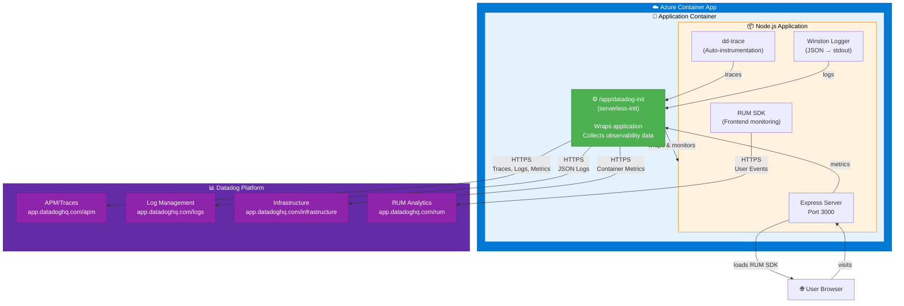

# Azure Container Apps Album Viewer UI with Datadog Observability

[](https://portal.azure.com/)

This repository demonstrates complete **Datadog observability integration** with **Azure Container Apps**, featuring a full-stack Album Viewer application with:

- ✅ **APM (Application Performance Monitoring)** - Distributed tracing across services
- ✅ **Log Management** - Centralized logging with trace correlation
- ✅ **Infrastructure Monitoring** - Container metrics and resource usage
- ✅ **Real User Monitoring (RUM)** - Frontend performance and user experience
- ✅ **Custom Metrics** - Business metrics and KPIs

## 🎯 What You'll Learn

This example shows you how to:

1. **Instrument a Node.js application** with Datadog APM using the in-container method
2. **Deploy to Azure Container Apps** with a Datadog sidecar container
3. **Collect logs** via shared volume between application and sidecar
4. **Monitor frontend performance** with Datadog RUM
5. **Correlate traces, logs, and RUM** for full-stack observability

## 📋 Prerequisites

- **Azure Account** with active subscription
- **Datadog Account** ([free trial available](https://www.datadoghq.com/))
- **Azure CLI** installed ([install guide](https://docs.microsoft.com/en-us/cli/azure/install-azure-cli))
- **Docker** installed (optional, for local testing)
- **Node.js** v16+ (optional, for local development)

## 🚀 Quick Start

This example uses the **official Datadog In-Container instrumentation method** for Azure Container Apps.

**Reference**: [Datadog Azure Container Apps In-Container Documentation](https://docs.datadoghq.com/serverless/azure_container_apps/in_container/nodejs/)

### 1. Prerequisites

- Azure subscription with Container Apps environment created
- Azure Container Registry (ACR) created
- Datadog account with:
  - API Key from [API Keys page](https://app.datadoghq.com/organization-settings/api-keys)
  - RUM Application created at [RUM Applications](https://app.datadoghq.com/rum/list)

### 2. Configure Environment Variables

```bash
# Clone repository
git clone https://github.com/nuttea/containerapps-albumui.git
cd containerapps-albumui

# Create .env.local file with your configuration
cat > .env.local <<'EOF'
# Azure Configuration
RESOURCE_GROUP="datadog-aca-demo"
LOCATION="southeastasia"
ACR_NAME="mydatadogacr"              # Must be globally unique, lowercase, no hyphens
CONTAINERAPPS_ENV="datadog-env"
APP_NAME="albumui-api"
ENVIRONMENT="env-album-containerapps"
API_NAME="album-api"
FRONTEND_NAME="album-ui"
GITHUB_USERNAME="<gh-user>"

# Datadog Configuration
DD_API_KEY="your-datadog-api-key-here"
DD_SITE="datadoghq.com"              # or us5.datadoghq.com, datadoghq.eu, etc.
DD_SERVICE="albumui-api"
DD_ENV="production"
DD_VERSION="1.0"
DD_AZURE_SUBSCRIPTION_ID="your-azure-subscription-id-here"  # Required for Azure Container Apps
DD_RUM_APPLICATION_ID="your-rum-app-id-here"
DD_RUM_CLIENT_TOKEN="your-rum-client-token-here"

# Application Configuration
NODE_ENV="production"
EOF

# Get your Azure Subscription ID (if you don't know it)
az account show --query id -o tsv

# Edit .env.local with your actual values
nano .env.local  # or use your preferred editor

# Load environment variables
source .env.local
```

**Edit the following values** in `.env.local`:
- `RESOURCE_GROUP` - Your Azure resource group name
- `LOCATION` - Azure region (e.g., southeastasia, eastus, westeurope)
- `ACR_NAME` - Your Azure Container Registry name (globally unique, lowercase)
- `ENVIRONMENT` - Your Container Apps environment name
- `APP_NAME` - Your application name
- `DD_API_KEY` - Your Datadog API key
- `DD_SITE` - Your Datadog site (e.g., datadoghq.com, us5.datadoghq.com)
- `DD_SERVICE` - Service name in Datadog (matches APP_NAME)
- `DD_RUM_APPLICATION_ID` - Your RUM application ID
- `DD_RUM_CLIENT_TOKEN` - Your RUM client token

### 3. Create Azure Resources

```bash
# Create resource group (if not exists)
az group create \
  --name $RESOURCE_GROUP \
  --location $LOCATION

# Create Azure Container Registry (if not exists)
az acr create \
  --name $ACR_NAME \
  --resource-group $RESOURCE_GROUP \
  --sku Basic \
  --location $LOCATION \
  --admin-enabled true

# Create Container Apps Environment (REQUIRED)
az containerapp env create \
  --name $ENVIRONMENT \
  --resource-group $RESOURCE_GROUP \
  --location $LOCATION
```

### 4. Build and Push Docker Image

```bash
# Generate unique build tag
export BUILD_TAG=$(date +%s)
echo "🏷️  Build Tag: $BUILD_TAG"

# Build Docker image locally
docker build \
  -t $ACR_NAME.azurecr.io/albumui:latest \
  -t $ACR_NAME.azurecr.io/albumui:$BUILD_TAG \
  -f src/Dockerfile \
  src/

# Login to Azure Container Registry
az acr login --name $ACR_NAME

# Push both tags to ACR
docker push $ACR_NAME.azurecr.io/albumui:latest
docker push $ACR_NAME.azurecr.io/albumui:$BUILD_TAG

echo "✅ Built and pushed images:"
echo "   - $ACR_NAME.azurecr.io/albumui:latest"
echo "   - $ACR_NAME.azurecr.io/albumui:$BUILD_TAG"
```

### 5. Deploy to Azure Container Apps

```bash
# Get ACR credentials
ACR_USERNAME=$(az acr credential show --name $ACR_NAME --query username -o tsv)
ACR_PASSWORD=$(az acr credential show --name $ACR_NAME --query "passwords[0].value" -o tsv)

# Create container app with ACR credentials
# Using $BUILD_TAG ensures a new revision is created
az containerapp create \
  --name $APP_NAME \
  --resource-group $RESOURCE_GROUP \
  --environment $ENVIRONMENT \
  --image $ACR_NAME.azurecr.io/albumui:$BUILD_TAG \
  --registry-server $ACR_NAME.azurecr.io \
  --registry-username $ACR_USERNAME \
  --registry-password $ACR_PASSWORD \
  --target-port 3000 \
  --ingress external \
  --cpu 0.5 \
  --memory 1.0Gi

# Get the application URL (FQDN) for API_BASE_URL
API_BASE_URL=$(az containerapp show \
  --name $APP_NAME \
  --resource-group $RESOURCE_GROUP \
  --query properties.configuration.ingress.fqdn -o tsv)

echo "Application deployed at: https://$API_BASE_URL"

# Set Datadog API key as secret
az containerapp secret set \
  --name $APP_NAME \
  --resource-group $RESOURCE_GROUP \
  --secrets datadog-api-key="$DD_API_KEY"

# Configure environment variables (including API_BASE_URL for backend communication)
az containerapp update \
  --name $APP_NAME \
  --resource-group $RESOURCE_GROUP \
  --image $ACR_NAME.azurecr.io/albumui:$BUILD_TAG \
  --set-env-vars \
    API_BASE_URL="https://$API_BASE_URL" \
    DD_API_KEY=secretref:datadog-api-key \
    DD_SITE="$DD_SITE" \
    DD_SERVICE="$DD_SERVICE" \
    DD_ENV="$DD_ENV" \
    DD_VERSION="$DD_VERSION" \
    DD_AZURE_SUBSCRIPTION_ID="$DD_AZURE_SUBSCRIPTION_ID" \
    DD_AZURE_RESOURCE_GROUP="$RESOURCE_GROUP"
    DD_LOGS_ENABLED="true" \
    DD_LOGS_INJECTION="true" \
    DD_SOURCE="nodejs" \
    DD_RUM_APPLICATION_ID="$DD_RUM_APPLICATION_ID" \
    DD_RUM_CLIENT_TOKEN="$DD_RUM_CLIENT_TOKEN" \
    NODE_ENV="$NODE_ENV"

echo "✅ Datadog configuration complete!"
echo "Application URL: https://$API_BASE_URL"
```

### 6. Verify in Datadog

After 2-3 minutes, check:

- **Application URL**: Open https://$API_BASE_URL in your browser
- **APM**: [Services](https://app.datadoghq.com/apm/services) → Look for your service name
- **Logs**: [Log Explorer](https://app.datadoghq.com/logs) → Filter by `service:<your-service>`
- **RUM**: [RUM Applications](https://app.datadoghq.com/rum/list) → Select your application
- **Infrastructure**: [Containers](https://app.datadoghq.com/infrastructure) → Filter by service

## 📚 Documentation

### Comprehensive Guide

See **[DATADOG_INTEGRATION_GUIDE.md](./DATADOG_INTEGRATION_GUIDE.md)** for:

- Detailed architecture overview
- Step-by-step setup instructions
- Troubleshooting guide
- Best practices
- Security considerations

### Deployment Files

- **[azure-containerapp.yaml](./azure-containerapp.yaml)** - Complete YAML configuration with Datadog In-Container setup

### Application Structure

```
containerapps-albumui/
├── src/
│   ├── app.js                 # Express app with Datadog logging
│   ├── tracer.js              # Datadog APM initialization (NEW)
│   ├── package.json           # Dependencies including dd-trace (UPDATED)
│   ├── Dockerfile             # Container build with Datadog (UPDATED)
│   ├── routes/
│   │   └── index.js           # Route handlers with custom spans (UPDATED)
│   └── views/
│       └── layout.pug         # Frontend with RUM integration (UPDATED)
├── .env.local                 # Your local config (create from README)
├── azure-containerapp.yaml    # Azure deployment config (NEW)
├── DATADOG_INTEGRATION_GUIDE.md  # Complete guide (NEW)
└── README.md                  # This file
```

## 🔍 What's Instrumented

### Backend (APM + Logs)

- ✅ HTTP requests and responses (automatic)
- ✅ External API calls to backend service (automatic)
- ✅ Custom spans and tags for business logic
- ✅ Error tracking with stack traces
- ✅ Custom metrics (album count, etc.)
- ✅ Winston JSON logging with trace correlation

### Frontend (RUM)

- ✅ Page views and navigation timing
- ✅ User interactions (clicks, form submissions)
- ✅ Frontend errors and stack traces
- ✅ Resource loading (images, CSS, JS)
- ✅ Core Web Vitals (LCP, FID, CLS)
- ✅ Session replay (20% sampling)

### Infrastructure

- ✅ Container CPU and memory usage
- ✅ Node.js runtime metrics (GC, event loop)
- ✅ Network metrics
- ✅ Azure Container Apps metadata

## 🏗️ Architecture

This example uses the **Datadog In-Container instrumentation method**, which embeds `serverless-init` directly into your application container (no separate sidecar needed).



**Reference**: [Datadog In-Container Method](https://docs.datadoghq.com/serverless/azure_container_apps/in_container/nodejs/)

### Key Integration Points

1. **`tracer.js`** - Initializes Datadog APM before any other code
2. **`Dockerfile`** - Copies `serverless-init` and sets it as ENTRYPOINT
3. **`NODE_OPTIONS`** - Enables dd-trace auto-instrumentation (`--require dd-trace/init`)
4. **Winston Logger** - Writes JSON logs to stdout (captured by serverless-init)
5. **RUM Script** - Loaded in `layout.pug` to monitor frontend

## 🔗 Code Examples

### Custom Span Example

See how we instrument the album loading route:

```javascript:1:30:src/routes/index.js
```

### Structured Logging Example

See how we configure Winston with Datadog correlation:

```javascript:15:69:src/app.js
```

### RUM Integration Example

See how we initialize RUM in the frontend:

```pug:9:72:src/views/layout.pug
```

## 🛠️ Local Development

### Run Locally (Without Datadog)

```bash
cd src
npm install
export API_BASE_URL=http://localhost:3500
npm start
```

Visit: http://localhost:3000

### Run Locally (With Datadog)

```bash
cd src
npm install

# Set Datadog environment variables
export DD_SERVICE=albumui-frontend
export DD_ENV=development
export DD_VERSION=1.0
export DD_API_KEY=your-api-key
export DD_SITE=datadoghq.com

# Optional: RUM credentials for frontend testing
export DD_RUM_APPLICATION_ID=your-rum-app-id
export DD_RUM_CLIENT_TOKEN=your-rum-client-token

# Start app
npm start
```

> **Note**: Logs will write to console only when `/LogFiles` doesn't exist (local dev)

## 📊 Monitoring Best Practices

### Tagging Strategy

Use consistent tags across all services:

```bash
DD_SERVICE=albumui-frontend    # Service name
DD_ENV=production              # Environment (dev/staging/prod)
DD_VERSION=1.0                 # Application version
```

### Custom Metrics

Add business metrics:

```javascript
const tracer = require('dd-trace');

// Increment counter
tracer.dogstatsd.increment('albums.viewed', 1, { album_id: '123' });

// Set gauge
tracer.dogstatsd.gauge('albums.loaded', albumCount);
```

### Error Tracking

Tag errors with context:

```javascript
const span = tracer.scope().active();
span.setTag('error', true);
span.setTag('error.type', error.name);
span.setTag('error.msg', error.message);
```

## 🐛 Troubleshooting

### Container Crashing or Failed to Start?

**Check container logs immediately:**
```bash
# View recent logs (last 50 lines)
az containerapp logs show \
  --name $APP_NAME \
  --resource-group $RESOURCE_GROUP \
  --tail 50

# Follow logs in real-time
az containerapp logs show \
  --name $APP_NAME \
  --resource-group $RESOURCE_GROUP \
  --follow

# Check system logs
az containerapp logs show \
  --name $APP_NAME \
  --resource-group $RESOURCE_GROUP \
  --type system \
  --tail 50
```

**Common causes and solutions:**

1. **Exit Code 1 - Application Error**
   - Check logs for the specific error message
   - Often: missing dependencies, syntax errors, or environment variable issues

2. **Missing node_modules**: Make sure `npm install` ran in Dockerfile
   ```bash
   # Check if dependencies were installed
   docker run --rm $ACR_NAME.azurecr.io/albumui:latest ls -la /nodejs/node_modules
   ```

3. **Port mismatch**: App must listen on port 3000 (EXPOSE 3000)

4. **Environment variables**: Check required env vars are set
   ```bash
   # Verify all env vars
   az containerapp show --name $APP_NAME --resource-group $RESOURCE_GROUP \
     --query "properties.template.containers[0].env[].{name:name,value:value}" -o table
   ```

5. **Datadog tracer issues**: Check if tracer initialization is causing crash
   ```bash
   # Look for tracer errors in logs
   az containerapp logs show --name $APP_NAME --resource-group $RESOURCE_GROUP \
     --tail 100 | grep -i "error\|failed\|tracer"
   ```

6. **Missing API_BASE_URL or other required env vars**: App might need backend URL

**Check container configuration:**
```bash
# View full container config
az containerapp show \
  --name $APP_NAME \
  --resource-group $RESOURCE_GROUP \
  --output yaml

# Check revision status
az containerapp revision list \
  --name $APP_NAME \
  --resource-group $RESOURCE_GROUP \
  --output table
```

**Force new revision after image update:**
```bash
# After rebuilding and pushing Docker image with new BUILD_TAG, force new revision
export BUILD_TAG=$(date +%s)

# Rebuild with new tag
docker build \
  --no-cache \
  -t $ACR_NAME.azurecr.io/albumui:latest \
  -t $ACR_NAME.azurecr.io/albumui:$BUILD_TAG \
  -f src/Dockerfile \
  src/

# Login and push
az acr login --name $ACR_NAME
docker push $ACR_NAME.azurecr.io/albumui:latest
docker push $ACR_NAME.azurecr.io/albumui:$BUILD_TAG

# Update to the new tagged image (forces new revision)
az containerapp update \
  --name $APP_NAME \
  --resource-group $RESOURCE_GROUP \
  --image $ACR_NAME.azurecr.io/albumui:$BUILD_TAG

# Or use revision copy to force new deployment
az containerapp revision copy \
  --name $APP_NAME \
  --resource-group $RESOURCE_GROUP \
  --image $ACR_NAME.azurecr.io/albumui:$BUILD_TAG

# Restart the app (triggers new revision)
az containerapp revision restart \
  --resource-group $RESOURCE_GROUP \
  --app $APP_NAME \
  --revision $(az containerapp revision list \
    --name $APP_NAME \
    --resource-group $RESOURCE_GROUP \
    --query "[0].name" -o tsv)
```

### No Traces Appearing?

1. Check tracer initialization is first in `app.js`
2. Verify `DD_SERVICE` and `DD_ENV` are set:
   ```bash
   az containerapp show --name $APP_NAME --resource-group $RESOURCE_GROUP \
     --query properties.template.containers[0].env -o table
   ```
3. Check application logs:
   ```bash
   az containerapp logs show --name $APP_NAME --resource-group $RESOURCE_GROUP --tail 50
   ```

### Logs Not Showing?

1. Verify `DD_LOGS_ENABLED=true` is set
2. Check logs are being written:
   ```bash
   az containerapp logs show --name $APP_NAME --resource-group $RESOURCE_GROUP --tail 20
   ```
3. Ensure Winston is configured for JSON output to stdout

### RUM Not Working?

1. Verify RUM credentials in environment variables
2. Check browser console for errors
3. Ensure RUM script loads before user interactions

See [DATADOG_INTEGRATION_GUIDE.md](./DATADOG_INTEGRATION_GUIDE.md) for complete troubleshooting guide.

## 📖 Additional Resources

### Datadog Documentation

- [Azure Container Apps Integration](https://docs.datadoghq.com/serverless/azure_container_apps/)
- [Node.js APM Tracing](https://docs.datadoghq.com/tracing/trace_collection/automatic_instrumentation/dd_libraries/nodejs/)
- [RUM Browser Monitoring](https://docs.datadoghq.com/real_user_monitoring/browser/)
- [Log Management](https://docs.datadoghq.com/logs/log_collection/nodejs/)

### Azure Documentation

- [Azure Container Apps Overview](https://learn.microsoft.com/en-us/azure/container-apps/overview)
- [Microservices Communication](https://learn.microsoft.com/en-us/azure/container-apps/communicate-between-microservices)
- [Storage Mounts](https://learn.microsoft.com/en-us/azure/container-apps/storage-mounts)

### Original Azure Example

This example is based on the [Azure Container Apps code-to-cloud quickstart](https://docs.microsoft.com/en-us/azure/container-apps/quickstart-code-to-cloud) and [microservices communication guide](https://learn.microsoft.com/en-us/azure/container-apps/communicate-between-microservices).

## 🤝 Contributing

Contributions are welcome! Please:

1. Fork the repository
2. Create a feature branch
3. Make your changes with clear comments
4. Submit a pull request

## 📝 License

See [LICENSE.md](./LICENSE.md)

## 💬 Support

- **Issues**: [GitHub Issues](https://github.com/nuttea/containerapps-albumui/issues)
- **Datadog Support**: [Datadog Support Portal](https://help.datadoghq.com/)
- **Azure Support**: [Azure Support](https://portal.azure.com/#blade/Microsoft_Azure_Support/HelpAndSupportBlade)

## ⭐ Show Your Support

If this example helped you, please:

- ⭐ Star this repository
- 📢 Share with your team
- 🐛 Report issues or improvements

---

**Built with** ❤️ **for Datadog customers testing Azure Container Apps**

**Last Updated**: November 2025  
**Tested With**: Node.js v18+, dd-trace v5.0+, Azure Container Apps v1.0+